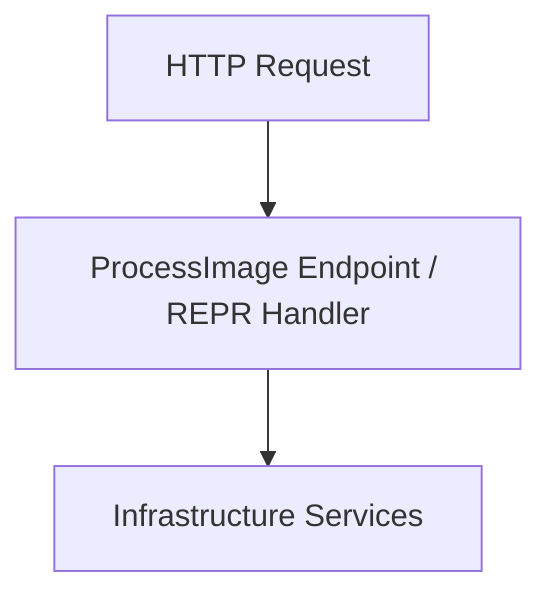

# Vertical Slice Architecture (VSA) Critique & Remediation Plan

This document analyzes the architectural flaws of the current implementation and provides a step-by-step remediation plan to align the project with a **100% pure Vertical Slice Architecture**.

---

## 1. Current Architectural Flaws

While the project organizes files into feature folders under [Feature](file:///C:/Users/Developer/Documents/Develop/CustomerProjects/MediaProcessing/MediaProcessing/Feature), it deviates from VSA principles in several key areas:

### 1.1. Deep Horizontal Layering Inside Slices
*   **The Issue:** Inside [ProcessImage](file:///C:/Users/Developer/Documents/Develop/CustomerProjects/MediaProcessing/MediaProcessing/Feature/ProcessImage), the codebase still adheres to traditional layered architecture patterns (Controller $\rightarrow$ Application Service Interface $\rightarrow$ Service Implementation $\rightarrow$ Domain/Infra Services).
*   **Why it violates VSA:** Vertical Slice Architecture emphasizes minimizing abstractions and "horizontal layers" within a single feature. Having a controller call an application service, which then calls an internal processing service, which then calls utilities, introduces unnecessary boilerplates, interfaces, and mapping logic.

### 1.2. Inter-Slice Coupling (Cohesion Leaks)
*   **The Issue:** [ImageProcessingAppService.cs](file:///C:/Users/Developer/Documents/Develop/CustomerProjects/MediaProcessing/MediaProcessing/Feature/ProcessImage/ImageProcessingAppService.cs#L35) directly injects and invokes [DeleteImageHandler](file:///C:/Users/Developer/Documents/Develop/CustomerProjects/MediaProcessing/MediaProcessing/Feature/DeleteImage/DeleteImageHandler.cs).
*   **Why it violates VSA:** Slices should be independent vertical columns of business capability. Direct dependencies between slices create tightly coupled features. If you modify the `DeleteImage` feature, it risks breaking the `ProcessImage` feature, violating the core VSA principle of isolated, self-contained changes.

### 1.3. Redundant Request DTOs & Validation Overlap
*   **The Issue:** There are two request classes for a single feature: [ImageProcessRequest.cs](file:///C:/Users/Developer/Documents/Develop/CustomerProjects/MediaProcessing/MediaProcessing/Feature/ProcessImage/ImageProcessRequest.cs) (for HTTP controller mapping) and [ImageProcessingRequest.cs](file:///C:/Users/Developer/Documents/Develop/CustomerProjects/MediaProcessing/MediaProcessing/Feature/ProcessImage/ImageProcessingRequest.cs) (for the service layer).
*   **Why it violates VSA:** VSA favors simplicity. A single, unified request record that flows from the HTTP entry point down to the data processing/handler logic reduces boilerplate mapping code and keeps the feature self-contained.

---

## 2. Remediation Plan to Achieve 100% VSA

To align the project with pure VSA, apply the following refactoring steps:

### Step 2.1. Adopt Minimal APIs or Single-Action Handlers
Instead of using standard controllers that route to nested services, represent each HTTP endpoint as a single, self-contained endpoint or handler using **Minimal APIs** or the **REPR (Request-Endpoint-Response) pattern**.



*   **Action:** Group the endpoint definition, request DTO, response DTO, and validation rules in a single file or a unified folder.

### Step 2.2. Collapse Inner Layers into a Single Handler
Remove the `IImageProcessingAppService` and `IImageProcessingService` abstractions. Merge the orchestration and image processing logic into a single command handler class (e.g., `ProcessImageHandler`).

*   **Target Structure for `ProcessImage` slice:**
    ```
    Feature/
    └── ProcessImage/
        ├── ProcessImageEndpoint.cs (Defines request, response, and Minimal API mapping)
        ├── ProcessImageHandler.cs (Executes the full slice validation, compression, and saving)
        └── ImageValidator.cs (Slice-specific utility)
    ```

### Step 2.3. Decouple Slice Interdependencies
To remove the dependency of `ProcessImage` on `DeleteImageHandler`, choose one of the following decoupled approaches:

1.  **Orchestrate at the Endpoint/Controller Level:** The controller/endpoint orchestrates the two actions sequentially:
    ```csharp
    // Inside the endpoint/controller
    var processResult = await processHandler.HandleAsync(processCommand);
    if (processResult.IsSuccess && !string.IsNullOrEmpty(existingImage))
    {
        await deleteHandler.HandleAsync(new DeleteImageCommand(existingImage));
    }
    ```
2.  **Use Domain Events / MediatR:** Let `ProcessImage` publish an `ImageReplacedEvent` after saving the new image, and let `DeleteImageHandler` subscribe to it asynchronously to delete the old file.

### Step 2.4. Simplify Infrastructure Registrations
Since infrastructure services like `FileService` and `WebPCompressor` are shared cross-cutting concerns, keep registering them in [Infrastructure](file:///C:/Users/Developer/Documents/Develop/CustomerProjects/MediaProcessing/MediaProcessing/Infrastructure), but ensure they are injected directly into the VSA slice Handlers without unnecessary wrapping interfaces.

---

## 3. Structural Comparison

| Component | Current Implementation | Target 100% VSA Implementation |
| :--- | :--- | :--- |
| **HTTP Routing** | [ImageProcessorController](file:///C:/Users/Developer/Documents/Develop/CustomerProjects/MediaProcessing/MediaProcessing/Feature/ProcessImage/ImageProcessorController.cs) (Controller Base) | Minimal API Endpoints mapped directly inside the feature folder |
| **Request Model** | Two duplicate models ([ImageProcessRequest](file:///C:/Users/Developer/Documents/Develop/CustomerProjects/MediaProcessing/MediaProcessing/Feature/ProcessImage/ImageProcessRequest.cs) & [ImageProcessingRequest](file:///C:/Users/Developer/Documents/Develop/CustomerProjects/MediaProcessing/MediaProcessing/Feature/ProcessImage/ImageProcessingRequest.cs)) | Single unified Request Record per slice |
| **Core Logic** | Split between `AppService` and `Service` implementations | Single `Handler` containing sequential business flow |
| **Slice Coupling** | Tight coupling (`ProcessImage` calls `DeleteImageHandler` directly) | Decoupled via API orchestration or Event-Driven messaging |
